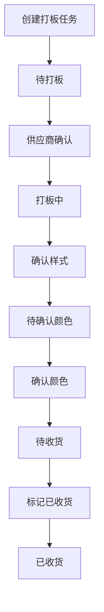
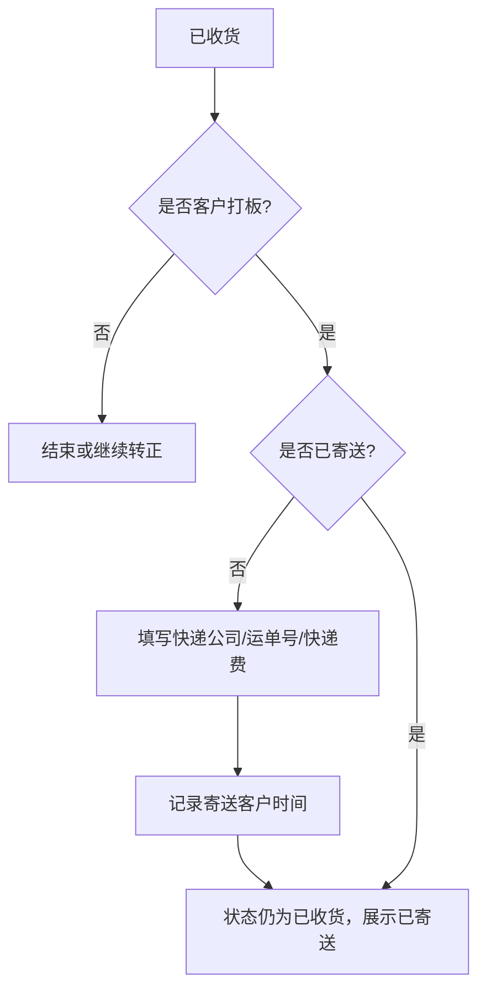
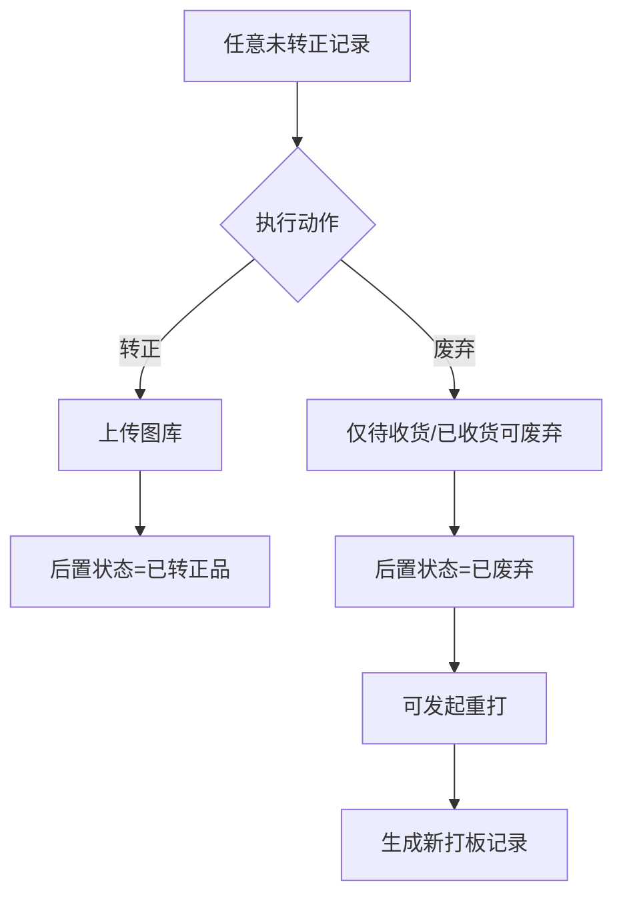
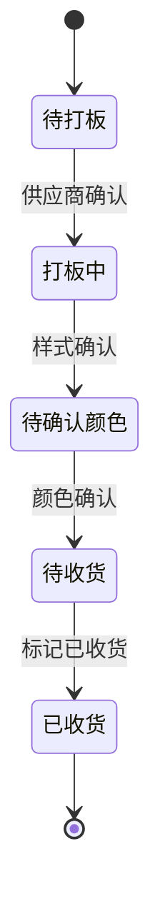
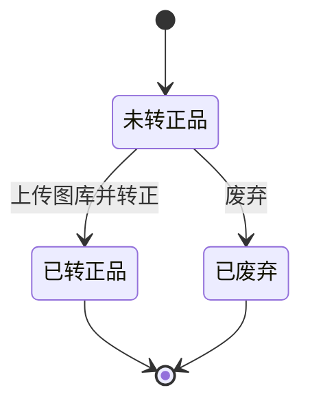
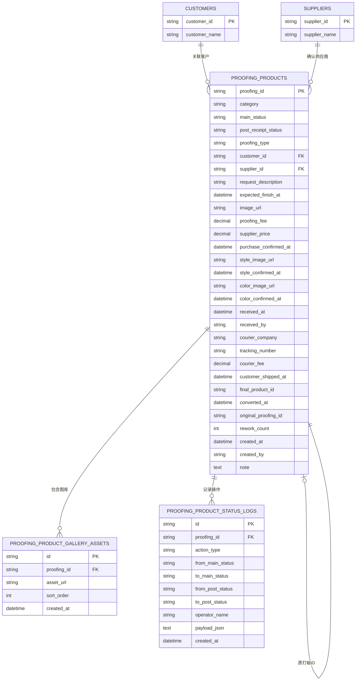

# CRM 打板产品需求文档

## TOC

- 0. 文档信息
- 1. 背景与目标
- 2. 需求范围
- 3. 角色与术语
- 4. 页面与交互范围
- 5. 用户故事与验收标准
- 6. 核心业务流程
- 7. 状态机与状态说明
- 8. 数据模型与建表建议
- 9. 字段字典与派生规则
- 10. 列表与详情展示规则
- 11. 操作规则与校验逻辑
- 12. 接口事件建议
- 13. 非功能需求
- 14. MVP、非目标与验收清单

---

## 0. 文档信息

- 文档类型：`PRD（Product Requirements Document）`
- 文档名称：`CRM 打板产品需求文档`
- 文件名：`crm-proofing-product-requirements.md`
- 当前版本：`v1.0`
- 当前状态：`Draft`
- 创建日期：`2026-05-07`
- 主要读者：`老板`、`内部开发`、`AI 开发代理`
- 参考原型：`src/prototypes/crm-presale-product/`
- 对齐原则：以参考原型和 `spec.md` 为准，旧说明仅保留兼容口径

---

## 1. 背景与目标

### 1.1 背景问题

当前打板业务存在以下问题：

1. 历史上以“产品 + 规格”驱动打板，导致一条业务任务被拆散到多个规格状态中，难以追踪单次打板闭环。
2. 业务、采购、跟单围绕同一打板任务协作时，缺少统一主键和统一状态口径。
3. 客户打板与内部开发在字段要求、寄送动作、费用记录上存在差异，旧模型表达不清。
4. 废弃后重打、提前转正、收货后寄送客户等业务动作没有被稳定建模，容易导致开发逻辑分叉。

### 1.2 目标

本需求要建立一套可直接指导开发的打板任务模型，核心目标如下：

1. 使用 `打板ID` 作为单次打板任务的唯一主键。
2. 用单条打板记录承载业务、采购、样式确认、颜色确认、收货、寄送、转正、废弃、重打全链路。
3. 将 `主生命周期状态` 与 `后置正品状态` 分离，支持“主状态不变，但已转正/已废弃”的业务现实。
4. 让 AI 或开发人员可以基于本文件直接完成数据建模、接口设计、列表页、详情页和状态流转实现。

### 1.3 成功标准

1. 一条打板任务从创建到结束可以被单一 `打板ID` 完整追踪。
2. 同一条记录可准确表达：
   - 当前主流程走到哪一阶段
   - 是否已收货
   - 是否已转正品
   - 是否已废弃
   - 是否已寄送给客户
3. 开发不再依赖额外口头解释即可完成：
   - 数据表设计
   - 状态机实现
   - 列表筛选与操作按钮判断
   - 重打与转正的业务分支

---

## 2. 需求范围

### 2.1 本期范围

1. 打板产品管理单页
2. 分类侧栏筛选
3. 列表搜索、状态筛选、收货状态筛选、正品状态筛选
4. 新建打板产品
5. 供应商确认
6. 样式确认
7. 颜色确认
8. 标记已收货
9. 寄送给客户
10. 转正品
11. 废弃
12. 发起重打
13. 详情抽屉
14. 样例数据兼容与旧数据兼容映射

### 2.2 本期不包含

1. 后端真实接口实现
2. 文件真实上传落盘方案
3. 供应商主数据管理页面
4. 审批流、权限审批流
5. 正品产品主档管理
6. 物流轨迹查询
7. 财务结算与应付应收联动

---

## 3. 角色与术语

### 3.1 业务角色

| 角色 | 职责 |
|------|------|
| 业务/产品 | 创建打板任务，查看全局进度，执行转正、废弃、重打 |
| 采购 | 确认供应商与供应商打板价，推动进入打板中 |
| 跟单/内部人员 | 确认样式、确认颜色、确认收货、维护寄送信息 |
| 客户 | 仅通过业务侧间接参与客户打板，不直接操作系统 |

### 3.2 关键术语

| 术语 | 定义 |
|------|------|
| `打板ID` | 单次打板任务唯一编号 |
| `主生命周期状态` | 打板任务在主流程中的阶段状态 |
| `后置正品状态` | 在主流程之外，用于标记是否已转正品或已废弃 |
| `收货状态` | 展示态字段，通过主状态计算得到 |
| `寄送状态` | 展示态字段，通过 `寄送客户时间` 是否存在计算得到 |
| `重打` | 从已废弃记录复制业务核心信息，生成新 `打板ID` 的新任务 |

---

## 4. 页面与交互范围

```text
CRM 打板产品管理
├─ 顶部品牌栏
├─ 顶部工具栏
├─ 左侧导航
└─ 主内容区
   └─ 主卡片
      ├─ 分类侧栏
      └─ 内容区
         ├─ 页面标题 + 新建按钮
         ├─ 筛选栏
         ├─ 打板任务列表
         └─ 详情抽屉
            ├─ 头部摘要
            ├─ 状态时间轴
            └─ 底部操作栏
```

页面路径：`/prototypes/crm-presale-product`

---

## 5. 用户故事与验收标准

### US-01 新建打板任务

**As a** 业务/产品  
**I want to** 创建内部开发或客户打板任务  
**So that** 后续所有协作都围绕单一 `打板ID` 推进

**Acceptance Criteria**

1. Given 用户打开“新建打板产品”
   When 填完必填字段并提交
   Then 系统生成新的 `打板ID`，记录状态为 `待打板`，后置状态为 `未转正品`。

2. Given 打板类型为 `客户打板`
   When 未选择客户或未填写打板费用
   Then 系统不允许提交。

3. Given 打板类型为 `内部开发`
   When 创建记录
   Then 不展示客户与打板费用输入项。

### US-02 采购确认供应商

**As a** 采购  
**I want to** 确认供应商与供应商打板价  
**So that** 任务可以正式进入打板执行阶段

**Acceptance Criteria**

1. Given 记录状态为 `待打板`
   When 用户填写供应商和供应商打板价并提交
   Then 记录写入供应商信息、采购确认时间，主状态更新为 `打板中`。

### US-03 样式确认与颜色确认

**As a** 跟单/内部人员  
**I want to** 逐步确认样式与颜色  
**So that** 打板任务可以进入待收货阶段

**Acceptance Criteria**

1. Given 记录状态为 `打板中`
   When 用户提交样式确认
   Then 样式图片可为空，系统记录样式确认时间，主状态更新为 `待确认颜色`。

2. Given 记录状态为 `待确认颜色`
   When 用户上传颜色图片并提交
   Then 系统记录颜色图片、颜色确认时间，主状态更新为 `待收货`。

3. Given 颜色图片为空
   When 用户提交颜色确认
   Then 系统不允许提交。

### US-04 收货与寄送客户

**As a** 跟单/内部人员  
**I want to** 在待收货后确认到货，并在客户打板场景下寄送给客户  
**So that** 系统能清楚区分“已收货”和“已寄送给客户”

**Acceptance Criteria**

1. Given 记录状态为 `待收货` 且后置状态不是 `已废弃`
   When 用户点击“标记已收货”
   Then 系统记录收货时间、收货操作人，主状态更新为 `已收货`。

2. Given 记录状态为 `已收货`、打板类型为 `客户打板`、未寄送客户、后置状态不是 `已废弃`
   When 用户填写快递公司、运单号、快递费并提交
   Then 系统记录寄送信息和 `寄送客户时间`，主状态保持 `已收货` 不变。

### US-05 转正品

**As a** 业务/产品  
**I want to** 在任意未转正阶段直接转正  
**So that** 业务可以提前完成正品归档，不被主流程限制

**Acceptance Criteria**

1. Given 后置状态为 `未转正品`
   When 用户上传至少 1 张图库图片并确认转正
   Then 系统记录图库、转正时间，后置状态更新为 `已转正品`。

2. Given 用户未上传图库图片
   When 提交转正
   Then 系统不允许提交。

3. Given 记录已转正
   When 查看详情或列表
   Then 主状态保持原值，正品状态显示为 `已转正品`。

### US-06 废弃与重打

**As a** 业务/产品  
**I want to** 废弃无效样品并从原单发起重打  
**So that** 新旧任务可以持续追踪

**Acceptance Criteria**

1. Given 记录主状态为 `待收货` 或 `已收货`，且后置状态为 `未转正品`
   When 用户确认废弃
   Then 系统将后置状态更新为 `已废弃`，主状态保持不变。

2. Given 记录后置状态为 `已废弃`
   When 用户发起重打
   Then 系统复制原记录的核心业务信息生成新记录，新记录主状态为 `待打板`，后置状态为 `未转正品`，并写入 `原打板ID` 与递增的 `重打次数`。

### US-07 列表筛选与详情追踪

**As a** 业务/产品/管理者  
**I want to** 在一个界面中筛选、查看和追踪所有打板任务  
**So that** 我能快速定位任务并判断下一步动作

**Acceptance Criteria**

1. Given 用户在列表页操作筛选器
   When 按分类、主状态、收货状态、正品状态、关键词筛选
   Then 列表返回符合条件的记录。

2. Given 用户打开详情抽屉
   When 查看头部摘要与时间轴
   Then 能看到当前主状态、正品状态、寄送状态、收货状态和各阶段关键时间。

---

## 6. 核心业务流程

### 6.1 主流程



### 6.2 客户打板寄送分支



### 6.3 转正与废弃分支



### 6.4 流程说明表

| 步骤 | 触发者 | 前置条件 | 输出结果 |
|------|------|------|------|
| 新建打板 | 业务/产品 | 必填字段完整 | 新建 `待打板` 记录 |
| 供应商确认 | 采购 | 状态=`待打板` | 写入供应商信息，状态=`打板中` |
| 样式确认 | 跟单/内部人员 | 状态=`打板中` | 写入样式确认时间，状态=`待确认颜色` |
| 颜色确认 | 跟单/内部人员 | 状态=`待确认颜色` 且颜色图片存在 | 写入颜色确认时间，状态=`待收货` |
| 标记已收货 | 跟单/内部人员 | 状态=`待收货` 且未废弃 | 写入收货时间/收货人，状态=`已收货` |
| 寄送给客户 | 跟单/内部人员 | 状态=`已收货` 且客户打板且未寄送且未废弃 | 写入物流信息和寄送时间 |
| 转正品 | 业务/产品 | 后置状态=`未转正品` 且图库至少 1 张 | 后置状态=`已转正品` |
| 废弃 | 业务/产品 | 状态=`待收货/已收货` 且后置状态=`未转正品` | 后置状态=`已废弃` |
| 发起重打 | 业务/产品 | 后置状态=`已废弃` | 生成新记录并回链 |

---

## 7. 状态机与状态说明

### 7.1 设计原则

本业务必须拆成两套状态：

1. `主生命周期状态`
   - 表示打板主流程走到哪一步
   - 用于决定页面主操作
2. `后置正品状态`
   - 表示该记录是否已转正品或已废弃
   - 不改变主流程状态

### 7.2 主生命周期状态机



### 7.3 后置正品状态机



### 7.4 组合状态关系说明

1. `已转正品` 与 `已废弃` 不再作为新的主状态持久化写入。
2. 记录转正后，主状态依然可能是：
   - `待打板`
   - `打板中`
   - `待确认颜色`
   - `待收货`
   - `已收货`
3. 记录废弃后，主状态依然可能保留 `待收货` 或 `已收货`，通过 `后置状态=已废弃` 表示业务终止。

### 7.5 状态说明表

| 状态类型 | 状态值 | 进入条件 | 可执行动作 | 退出条件 |
|------|------|------|------|------|
| 主状态 | `待打板` | 新建成功，或重打生成新单 | 供应商确认、转正 | 供应商确认后进入 `打板中` |
| 主状态 | `打板中` | 已确认供应商与打板价 | 确认样式、转正 | 样式确认后进入 `待确认颜色` |
| 主状态 | `待确认颜色` | 已完成样式确认 | 确认颜色、转正 | 颜色确认后进入 `待收货` |
| 主状态 | `待收货` | 已完成颜色确认 | 标记已收货、转正、废弃 | 收货后进入 `已收货` |
| 主状态 | `已收货` | 已确认收货 | 寄送客户、转正、废弃 | 终态，可保留长期展示 |
| 后置状态 | `未转正品` | 新建默认值 | 转正、废弃 | 转正后为 `已转正品`，废弃后为 `已废弃` |
| 后置状态 | `已转正品` | 转正成功 | 只读查看 | 终态 |
| 后置状态 | `已废弃` | 废弃成功 | 发起重打 | 原单终态 |

### 7.6 兼容规则

为兼容旧数据输入，系统需要支持以下映射：

| 旧状态 | 新口径 |
|------|------|
| `待打板` | `待打板` |
| `打板中` | `打板中` |
| `待确认样式` | `打板中` |
| `已打板` | `打板中` |
| `待确认颜色` | `待确认颜色` |
| `待收货` | `待收货` |
| `已收货` | `已收货` |
| `已转正品` | 主状态保留原值，后置状态映射为 `已转正品` |
| `已废弃` | 主状态保留原值，后置状态映射为 `已废弃` |

---

## 8. 数据模型与建表建议

### 8.1 核心实体

| 实体 | 说明 |
|------|------|
| `proofing_products` | 打板任务主表 |
| `proofing_product_gallery_assets` | 转正图库表 |
| `proofing_product_status_logs` | 状态操作日志表 |
| `customers` | 客户主数据，当前页面只引用 |
| `suppliers` | 供应商主数据，当前页面只引用 |

### 8.2 ER 图



### 8.3 主表建表建议

表名建议：`proofing_products`

| 字段 | 类型建议 | 必填 | 说明 |
|------|------|------|------|
| `proofing_id` | varchar(32) | 是 | 打板任务唯一编号 |
| `category` | varchar(32) | 是 | 分类 |
| `image_url` | text | 是 | 打板主图 |
| `request_description` | text | 是 | 需求描述 |
| `expected_finish_at` | datetime | 是 | 期望完成时间 |
| `main_status` | varchar(32) | 是 | 主生命周期状态 |
| `post_receipt_status` | varchar(32) | 是 | 后置正品状态，默认 `未转正品` |
| `proofing_type` | varchar(16) | 是 | `内部开发` / `客户打板` |
| `customer_id` | varchar(64) | 否 | 客户打板必填，内部开发为空 |
| `customer_name_snapshot` | varchar(128) | 否 | 快照字段，避免历史记录受主数据变更影响 |
| `proofing_fee` | decimal(10,2) | 否 | 客户打板必填 |
| `supplier_id` | varchar(64) | 否 | 供应商确认后写入 |
| `supplier_name_snapshot` | varchar(128) | 否 | 供应商名称快照 |
| `supplier_price` | decimal(10,2) | 否 | 供应商打板价 |
| `purchase_confirmed_at` | datetime | 否 | 供应商确认时间 |
| `style_image_url` | text | 否 | 样式图片 |
| `style_confirmed_at` | datetime | 否 | 样式确认时间 |
| `color_image_url` | text | 否 | 颜色图片 |
| `color_confirmed_at` | datetime | 否 | 颜色确认时间 |
| `received_at` | datetime | 否 | 收货时间 |
| `received_by` | varchar(64) | 否 | 收货操作人 |
| `courier_company` | varchar(64) | 否 | 寄送给客户时填写 |
| `tracking_number` | varchar(64) | 否 | 寄送给客户时填写 |
| `courier_fee` | decimal(10,2) | 否 | 寄送给客户时填写 |
| `customer_shipped_at` | datetime | 否 | 寄送客户时间 |
| `final_product_id` | varchar(64) | 否 | 兼容历史字段，当前原型不强制 |
| `converted_at` | datetime | 否 | 转正时间 |
| `original_proofing_id` | varchar(32) | 否 | 重打时回链原单 |
| `rework_count` | int | 是 | 默认 0 |
| `created_at` | datetime | 是 | 创建时间 |
| `created_by` | varchar(64) | 是 | 创建人 |
| `note` | text | 否 | 备注 |

### 8.4 图库表建表建议

表名建议：`proofing_product_gallery_assets`

| 字段 | 类型建议 | 必填 | 说明 |
|------|------|------|------|
| `id` | varchar(64) | 是 | 主键 |
| `proofing_id` | varchar(32) | 是 | 所属打板单 |
| `asset_url` | text | 是 | 图库图片地址 |
| `sort_order` | int | 是 | 排序 |
| `created_at` | datetime | 是 | 创建时间 |

### 8.5 状态日志表建表建议

表名建议：`proofing_product_status_logs`

| 字段 | 类型建议 | 必填 | 说明 |
|------|------|------|------|
| `id` | varchar(64) | 是 | 主键 |
| `proofing_id` | varchar(32) | 是 | 所属打板单 |
| `action_type` | varchar(32) | 是 | 如 `create`、`confirm_supplier`、`confirm_style` |
| `from_main_status` | varchar(32) | 否 | 原主状态 |
| `to_main_status` | varchar(32) | 否 | 新主状态 |
| `from_post_status` | varchar(32) | 否 | 原后置状态 |
| `to_post_status` | varchar(32) | 否 | 新后置状态 |
| `operator_name` | varchar(64) | 是 | 操作人 |
| `payload_json` | json/text | 否 | 本次操作附带业务字段 |
| `created_at` | datetime | 是 | 操作时间 |

### 8.6 索引建议

1. `uk_proofing_id(proofing_id)`
2. `idx_main_status(main_status)`
3. `idx_post_receipt_status(post_receipt_status)`
4. `idx_category(category)`
5. `idx_customer_id(customer_id)`
6. `idx_supplier_id(supplier_id)`
7. `idx_expected_finish_at(expected_finish_at)`
8. `idx_created_at(created_at)`
9. `idx_original_proofing_id(original_proofing_id)`

---

## 9. 字段字典与派生规则

### 9.1 持久化字段与展示字段区分

| 字段 | 是否持久化 | 说明 |
|------|------|------|
| `主状态` | 是 | 真正存库 |
| `后置状态` | 是 | 真正存库 |
| `收货状态` | 否 | 展示态，`main_status == 已收货 ? 已收货 : 未收货` |
| `寄送状态` | 否 | 展示态，`customer_shipped_at` 有值则 `已寄送`，否则 `未寄送` |
| `客户名称` | 建议存快照 | 方便历史回溯 |
| `供应商名称` | 建议存快照 | 方便历史回溯 |

### 9.2 字段字典

| 字段 | 业务含义 | 规则 |
|------|------|------|
| `proofing_type` | 打板类型 | 枚举：`内部开发`、`客户打板` |
| `main_status` | 主流程阶段 | 枚举：`待打板`、`打板中`、`待确认颜色`、`待收货`、`已收货` |
| `post_receipt_status` | 后置正品状态 | 枚举：`未转正品`、`已转正品`、`已废弃` |
| `customer_id` | 客户标识 | `客户打板` 必填 |
| `proofing_fee` | 客户打板费用 | `客户打板` 必填 |
| `supplier_price` | 供应商打板价 | 供应商确认时必填 |
| `style_image_url` | 样式图片 | 当前原型选填 |
| `color_image_url` | 颜色图片 | 颜色确认时必填 |
| `gallery` | 转正图库 | 转正时至少 1 张 |
| `final_product_id` | 正品产品编号 | 当前原型兼容保留，不强制 |
| `original_proofing_id` | 原打板单号 | 仅重打单有值 |
| `rework_count` | 重打次数 | 首单为 0，新单递增 |

### 9.3 ID 规则建议

- `打板ID` 建议格式：`DB + YYYYMM + 3位或更多流水号`
- 示例：`DB202605001`

---

## 10. 列表与详情展示规则

### 10.1 列表展示字段

列表应至少展示：

1. `打板ID`
2. `图片`
3. `分类`
4. `需求描述`
5. `打板类型`
6. `客户`
7. `期望完成时间`
8. `状态区`
9. `供应商 / 供应商打板价`
10. `操作区`

### 10.2 状态区展示规则

1. 当主状态是 `待打板`、`打板中`、`待确认颜色` 时，展示：
   - 打板状态
   - 正品状态
2. 当主状态是 `待收货`、`已收货` 时，展示：
   - 收货状态
   - 正品状态
3. 当 `customer_shipped_at` 有值且是 `客户打板` 时，额外展示 `已寄送` 标签。

### 10.3 列表操作按钮显示规则

| 条件 | 显示按钮 |
|------|------|
| `main_status = 待打板` | `供应商确认` |
| `main_status = 打板中` | `确认样式` |
| `main_status = 待确认颜色` | `确认颜色` |
| `main_status = 待收货` 且未废弃 | `标记已收货` |
| `post_receipt_status = 未转正品` | `转正品` |
| `main_status in (待收货, 已收货)` 且 `post_receipt_status = 未转正品` | `废弃` |
| `main_status = 已收货` 且 `proofing_type = 客户打板` 且未寄送且未废弃 | `寄送给客户` |
| `post_receipt_status = 已废弃` | `发起重打` |

### 10.4 详情抽屉展示规则

详情抽屉包含：

1. 头部摘要
   - 打板ID
   - 主状态标签
   - 收货状态标签（如适用）
   - 正品状态标签
   - 寄送状态标签（如适用）
   - 打板类型标签
   - 需求描述
   - 创建人 / 创建时间 / 期望完成日期
2. 状态时间轴
3. 底部固定操作区

### 10.5 时间轴展示规则

1. 时间轴只展示已到达阶段和当前阶段，不展示未来阶段。
2. `打板中` 节点承载“样式确认”信息，不单独持久化 `待确认样式` 状态。
3. `已转正品` 不作为时间轴主节点展示。
4. `已废弃` 可作为额外终止标记展示。

---

## 11. 操作规则与校验逻辑

### 11.1 新建规则

1. 必填：`分类`、`打板类型`、`图片`、`需求描述`、`期望完成时间`
2. `客户打板` 额外必填：`客户`、`打板费用`
3. 新建成功后：
   - `main_status = 待打板`
   - `post_receipt_status = 未转正品`

### 11.2 供应商确认规则

1. 仅 `待打板` 可操作
2. 必填：`供应商`、`供应商打板价`
3. 写入 `purchase_confirmed_at`

### 11.3 样式确认规则

1. 仅 `打板中` 可操作
2. `样式图片` 当前原型为选填
3. 写入 `style_confirmed_at`
4. 流转到 `待确认颜色`

### 11.4 颜色确认规则

1. 仅 `待确认颜色` 可操作
2. 必填：`颜色图片`
3. 写入 `color_confirmed_at`
4. 流转到 `待收货`

### 11.5 收货规则

1. 仅 `待收货` 且未废弃可操作
2. 写入：
   - `received_at`
   - `received_by`
3. 流转到 `已收货`

### 11.6 寄送客户规则

1. 必须同时满足：
   - `main_status = 已收货`
   - `proofing_type = 客户打板`
   - `customer_shipped_at` 为空
   - `post_receipt_status != 已废弃`
2. 必填：
   - `courier_company`
   - `tracking_number`
   - `courier_fee`
3. 操作后：
   - 写入 `customer_shipped_at`
   - 主状态保持 `已收货`

### 11.7 转正规则

1. 只要 `post_receipt_status = 未转正品` 即可操作
2. 必填：至少 1 张 `gallery` 图片
3. 操作后：
   - 写入 `converted_at`
   - `post_receipt_status = 已转正品`
4. 当前原型不强制填写 `final_product_id`

### 11.8 废弃规则

1. 仅 `待收货` 或 `已收货` 可操作
2. 且必须 `post_receipt_status = 未转正品`
3. 操作后：
   - `post_receipt_status = 已废弃`
   - 主状态保持原值不变

### 11.9 重打规则

1. 仅 `post_receipt_status = 已废弃` 可操作
2. 新记录复制以下字段：
   - `category`
   - `image_url`
   - `request_description`
   - `proofing_type`
   - `customer_id`
   - `customer_name_snapshot`
   - `proofing_fee`
   - `note`
3. 新记录重置以下字段：
   - 供应商相关字段
   - 样式/颜色相关字段
   - 收货相关字段
   - 寄送相关字段
   - 图库与转正相关字段
4. 新记录写入：
   - 新 `proofing_id`
   - `original_proofing_id = 原记录.proofing_id`
   - `rework_count = 原记录.rework_count + 1`
   - `main_status = 待打板`
   - `post_receipt_status = 未转正品`

---

## 12. 接口事件建议

当前原型暴露的动作事件可直接作为后续接口设计参考：

| 事件名 | 触发时机 | 关键载荷 |
|------|------|------|
| `on_select_proofing_product` | 选择打板单 | `proofing_id` |
| `on_create_proofing_product` | 新建打板单 | `proofing_id`、`proofing_type` |
| `on_start_proofing_purchase` | 供应商确认 | `proofing_id`、`supplier_id`、`supplier_price` |
| `on_confirm_proofing_style` | 样式确认 | `proofing_id`、`style_image` |
| `on_confirm_proofing_color` | 颜色确认 | `proofing_id`、`color_image` |
| `on_mark_proofing_received` | 标记已收货 | `proofing_id` |
| `on_ship_to_customer` | 寄送给客户 | `proofing_id`、`courier_company`、`tracking_number`、`courier_fee` |
| `on_convert_proofing_product` | 转正品 | `proofing_id`、`gallery` |
| `on_discard_proofing_product` | 废弃 | `proofing_id` |
| `on_rework_proofing_product` | 发起重打 | `from_proofing_id`、`new_proofing_id` |
| `on_select_category` | 切换分类 | `category` |

后端接口建议按“单动作单接口”组织，避免一个保存接口同时承担多种状态推进责任。

---

## 13. 非功能需求

1. 性能
   - 列表筛选响应应做到前端即时或接口 P95 `< 300ms`
   - 详情抽屉打开时间 P95 `< 400ms`
2. 可追踪性
   - 所有状态推进动作应写入日志表
   - 重打链路必须可从新单追溯原单
3. 一致性
   - 页面展示状态、接口状态、数据库状态必须使用同一套枚举
4. 可扩展性
   - `后置状态` 后续允许扩展更多业务结果，不影响主状态机
5. 数据兼容性
   - 兼容旧 `presale_products` 和旧状态值输入

---

## 14. MVP、非目标与验收清单

### 14.1 MVP

本期 MVP 必须完成：

1. 新建打板任务
2. 供应商确认
3. 样式确认
4. 颜色确认
5. 标记已收货
6. 寄送给客户
7. 转正品
8. 废弃
9. 发起重打
10. 列表筛选与详情抽屉

### 14.2 非目标

1. 不实现真实文件上传服务
2. 不实现审批工作流
3. 不实现正品主档自动生成
4. 不实现物流轨迹回传

### 14.3 Definition of Done

- [ ] 主表、图库表、日志表的数据结构已实现
- [ ] 主状态与后置状态严格分离
- [ ] 列表操作按钮条件与本文件一致
- [ ] 支持客户打板与内部开发两种新建规则
- [ ] 支持寄送给客户且不改变主状态
- [ ] 支持全流程未转正时直接转正
- [ ] 支持 `待收货/已收货` 阶段废弃
- [ ] 支持从已废弃记录发起重打
- [ ] 支持旧状态兼容映射
- [ ] 页面、接口、数据表三者状态口径一致
