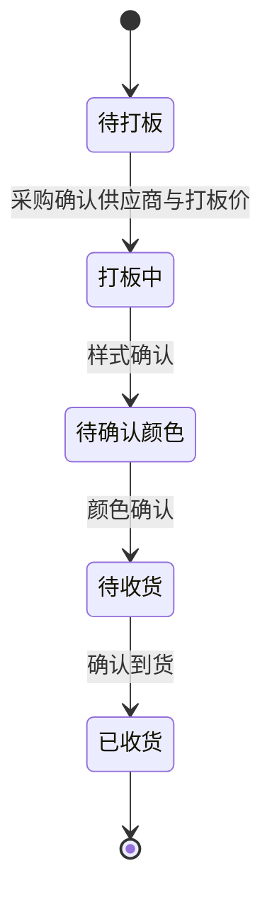
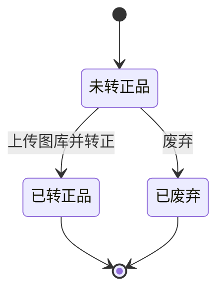
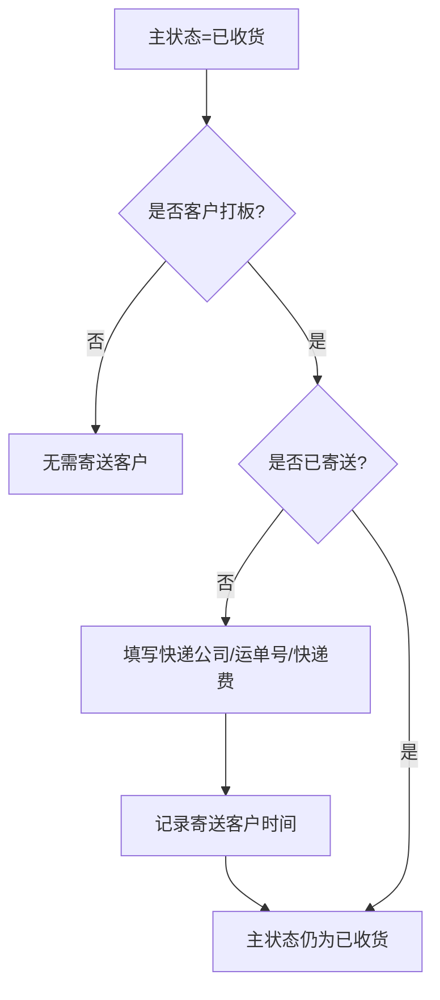

# 打板产品业务场景与状态流转

> 关联原型：`src/prototypes/crm-presale-product/`
> 默认数据：`src/database/proofing_products.json`
> 对齐口径：以当前参考原型和 `spec.md` 为准

## 1. 文档目标

- 统一打板产品当前版本的业务口径
- 明确主状态、后置状态、收货状态、寄送状态之间的关系
- 为原型、数据结构和后续接口设计提供同一套状态定义

## 2. 当前业务模型

### 2.1 核心变化

- 旧模型：1 个预售产品下挂多个规格，规格独立流转
- 新模型：1 条打板记录 = 1 次打板任务，全部围绕 `打板ID` 推进

### 2.2 当前模型关键原则

1. 主流程只保留 5 个持久化主状态：
   - `待打板`
   - `打板中`
   - `待确认颜色`
   - `待收货`
   - `已收货`
2. `已转正品` 和 `已废弃` 不再作为新的主状态推进，而是写入 `后置状态`。
3. `收货状态` 和 `寄送状态` 是展示态，不建议单独持久化。
4. `待确认样式` 不是当前版本的独立持久化主状态；若历史数据存在该值，统一兼容映射为 `打板中`。

## 3. 角色分工

| 角色 | 主要动作 |
|------|---------|
| 业务/产品 | 新建打板产品、查看全局状态、转正品、废弃、发起重打 |
| 采购 | 处理待打板任务、确认供应商、填写供应商打板价 |
| 跟单/内部人员 | 推进样式确认、颜色确认、确认收货、寄送客户 |
| 客户 | 不直接操作系统，仅通过业务侧参与客户打板结果接收 |

## 4. 业务场景

### 4.1 内部开发

内部团队发起打板需求，不需要客户和客户打板费用。

流程：

1. 业务创建打板任务
2. 采购确认供应商与打板价
3. 进入 `打板中`
4. 完成样式确认
5. 进入 `待确认颜色`
6. 完成颜色确认
7. 进入 `待收货`
8. 标记已收货
9. 保持 `已收货`，可继续转正品或废弃

### 4.2 客户打板

客户指定需求，需要绑定单个客户，并记录客户打板费用。

流程：

1. 业务创建客户打板任务
2. 采购确认供应商与打板价
3. 进入 `打板中`
4. 完成样式确认
5. 进入 `待确认颜色`
6. 完成颜色确认
7. 进入 `待收货`
8. 标记已收货
9. 若尚未寄送客户，可执行“寄送给客户”
10. 主状态仍保持 `已收货`

### 4.3 废弃后重打

当前原型中，只有收货阶段记录才允许废弃，废弃后支持从原单发起重打。

规则：

- 原记录主状态保持原值
- 原记录 `后置状态` 改为 `已废弃`
- 系统生成一条新的 `打板ID`
- 新单主状态为 `待打板`
- 新单 `后置状态` 为 `未转正品`
- 新单保留原始分类、图片、需求描述、客户信息等核心业务字段
- 新旧记录通过 `原打板ID` 追溯

## 5. 状态设计

### 5.1 主状态机

### 5.2 后置状态机

### 5.3 寄送客户分支

## 6. 状态说明表

| 类型 | 状态 | 进入条件 | 可执行动作 | 退出条件 |
|------|------|---------|-----------|---------|
| 主状态 | `待打板` | 新建成功后的默认状态；或重打生成的新单 | 供应商确认、转正 | 供应商确认后进入 `打板中` |
| 主状态 | `打板中` | 采购已确认供应商与打板价 | 样式确认、转正 | 样式确认后进入 `待确认颜色` |
| 主状态 | `待确认颜色` | 已完成样式确认 | 颜色确认、转正 | 颜色确认后进入 `待收货` |
| 主状态 | `待收货` | 已完成颜色确认 | 标记已收货、转正、废弃 | 收货后进入 `已收货` |
| 主状态 | `已收货` | 已确认收货 | 寄送客户、转正、废弃 | 主状态保持不变 |
| 后置状态 | `未转正品` | 新建默认值 | 转正、废弃 | 转正后为 `已转正品`；废弃后为 `已废弃` |
| 后置状态 | `已转正品` | 转正成功 | 只读查看 | 终态 |
| 后置状态 | `已废弃` | 废弃成功 | 发起重打 | 原单终态 |

## 7. 图片与物流规则

### 7.1 图片规则

- 新建时必须上传主打板图片
- 样式确认时，样式图片当前原型为选填
- 颜色确认时必须上传颜色图片
- 转正时必须上传至少 1 张图库图片

### 7.2 客户打板物流规则

- 当前版本不在颜色确认阶段采集“发照片/寄实物”确认方式
- 当前版本的物流动作发生在 `已收货` 之后
- 仅 `客户打板` 且 `已收货` 且未寄送的记录可执行“寄送给客户”
- 寄送给客户必须填写：
  - `快递公司`
  - `运单号`
  - `快递费`
- 寄送成功后写入 `寄送客户时间`

## 8. 转正品规则

- 当前原型允许全流程中任意 `未转正品` 记录直接转正
- 转正时必须上传至少 1 张图库图片
- 转正后主状态保持不变，仅将 `后置状态` 更新为 `已转正品`
- `正品产品ID` 当前为兼容历史字段，不是当前原型的必填项

## 9. 默认字段建议

| 字段 | 说明 |
|------|------|
| `打板ID` | 建议格式 `DB + YYYYMM + 序号` |
| `当前状态` | 当前版本建议只持久化 5 个主状态 |
| `后置状态` | 默认 `未转正品` |
| `原打板ID` | 仅重打单存在 |
| `重打次数` | 首单为 0，重打后递增 |
| `寄送客户时间` | 用于计算寄送状态 |
| `收货操作人` | 标记已收货时写入 |

## 10. 异常处理建议

| 场景 | 处理方式 |
|------|---------|
| 采购未确认 | 保持 `待打板`，不进入后续链路 |
| 客户打板未填打板费 | 不允许创建 |
| 颜色图片为空 | 不允许完成颜色确认 |
| 寄送客户缺少物流信息 | 不允许提交寄送 |
| 转正未上传图库 | 不允许完成转正 |
| 已废弃仍需继续 | 不恢复原单，统一从原单发起重打 |
